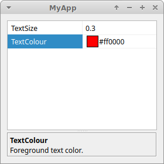

# How to Use QtnProperty in your Project

## Step 1

Create a Qt subdirs project. Include QtnProperty as a subdirectory. Include your project as a subdirectory that depends on QtnProperty:
```
TEMPLATE = subdirs
SUBDIRS += \
	QtnProperty\
	MyApp
MyApp.depends = QtnProperty
```

Include the QtnProperty.pri file in your subdirectory project´s pro file. This will add QtnPropertyCore and QtnPropertyWidget headers and libraries to your project:
```C++
include(../QtnProperty/QtnProperty.pri)
```
When you run qmake and make on the subdirectories project, the QtnProperties libraries and PEG Tool will be compiled and be ready to be used.

## Step 2a

You can now manually create property sets in your C++ code.

As an example, let´s create a QtnPropertyWidget with a property set that contains two properties: a float and a QColor. The float should have a minimum value of 0.0f, have a maximum value of 1.0f, be modified in steps of 0.1f and have an initial value of 0.3f. The QColor should have an initial value of red (255,0,0). We also give each property a name and a description:
```C++
#include <QApplication>
#include "PropertyWidget.h"
#include "Core/PropertyFloat.h"
#include "GUI/PropertyQColor.h"
class MyPropertyWidget : public QtnPropertyWidget
{
public:
    MyPropertyWidget()
    {
        QtnPropertySet* myPropertySet = new QtnPropertySet(this);
        QtnPropertyFloat* myFloatProperty = new QtnPropertyFloat(myPropertySet);
        myFloatProperty->setName(tr("TextSize"));
        myFloatProperty->setDescription(tr("Text Size"));
        myFloatProperty->setMinValue(0.f);
        myFloatProperty->setMaxValue(1.f);
        myFloatProperty->setStepValue(0.1f);
        myFloatProperty->setValue(0.3f);
        QtnPropertyQColor* myColourProperty = new QtnPropertyQColor(myPropertySet);
        myColourProperty->setName(tr("TextColour"));
        myColourProperty->setDescription(tr("Foreground text color"));
        myColourProperty->setValue(QColor(255,0,0));
        setPropertySet(myPropertySet);
    }
};
int main(int argc, char *argv[])
{
    QApplication app(argc, argv);
    MyPropertyWidget widget;
    widget.show();
    return app.exec();
}

```
This simple example will create a widget that looks like this:



## Step 2b

Alternatively, you can use the PEG Tool to convert .pef files into the required C++ code.

The .pef file format, provides an easy way to define and modify your properties. For example, to create the above property set, the PEG Tool will convert following .pef file into the required header and source files:
```C++
#include "PropertyCore.h"
#include "Core/PropertyFloat.h"
#include "GUI/PropertyQColor.h"

property_set MyPropertySet
{
    Float myFloatProperty
    {
        name = "TextSize";
        description = "Text size";
        value = 0.3f;
        minValue = 0.f;
        maxValue = 1.f;
        stepValue = 0.1f;
    }
    QColor myColorProperty
    {
        name = "TextColour";
        description = "Foreground text color";
        value = QColor(255, 0, 0);
    }
}
```

In your subdirectory project´s pro file, in addition to the QtnProperty.pri file, include the PEG.pri file. Create a PEG_SOURCES variable, and add your .pef files:
```C++
include(../QtnProperty/QtnProperty.pri)
include(../QtnProperty/PEG.pri)
SOURCES += myapp.cpp
PEG_SOURCES += myapp.pef
```

To use the generated property sets, simply include the generated header file, which has the same name as your .pef file, but with the extension .peg.h. Your property sets are defined as classes with QtnPropertySet prepended to the name you gave your property set. 
```C++
#include <QApplication>
#include "PropertyWidget.h"
#include "myapp.peg.h"
class MyPropertyWidget : public QtnPropertyWidget
{
public:
    MyPropertyWidget()
    {
        QtnPropertySet* myPropertySet = new QtnPropertySetMyPropertySet(this);
        setPropertySet(myPropertySet);
    }
};
int main(int argc, char *argv[])
{
    QApplication app(argc, argv);
    MyPropertyWidget widget;
    widget.show();
    return app.exec();
}
```

## Step 3

Your properties are now available in your application:
```C++
float textSize = myPropertySet->myFloatProperty;
QColor textColor = myPropertySet->myColorProperty;
```
For more advanced usage, look at the Demo source code provided.
