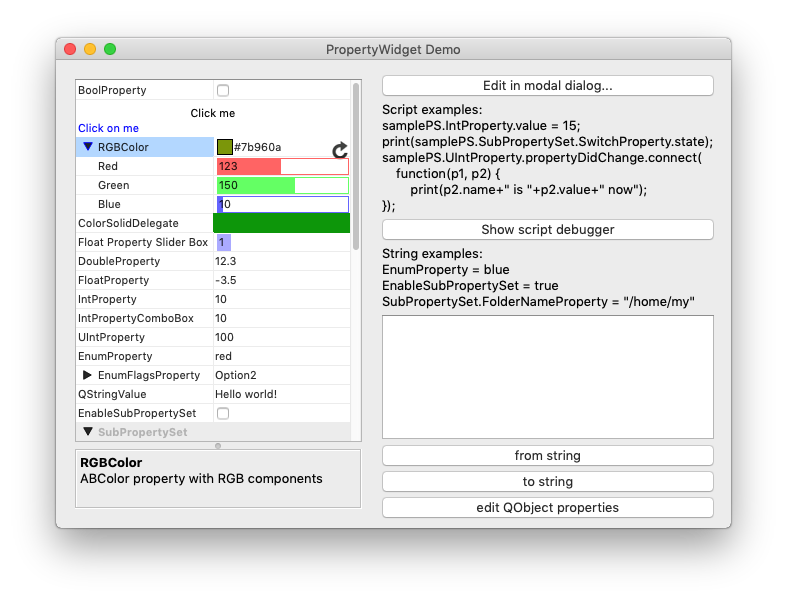
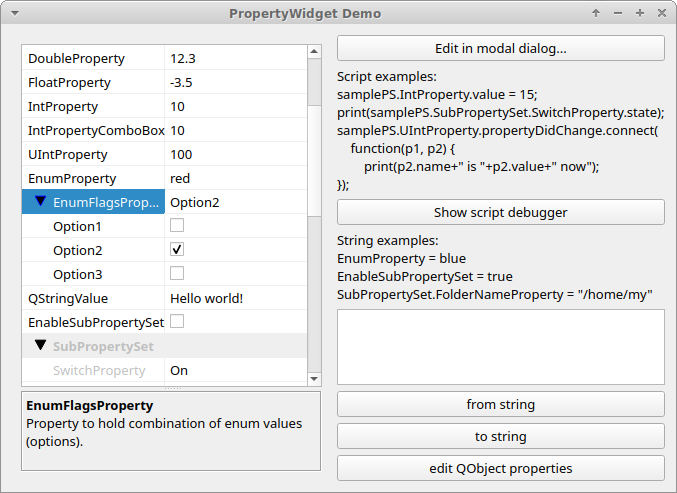

[](https://travis-ci.com/madmiraal/QtnProperty)

# QtnProperty

This is a user and programmer friendly extension of the [Qt Property System](https://doc.qt.io/qt-5/properties.html).

## Overview

The Qt Property System provides a cross-platform library for managing properties. QtnProperty is an extension of the Qt Property System that provides the following additional features:
* Property Widget: Observe and edit properties in a uniform way.
* Properties Hierarchy: Organise properties in a hierarchy of any depth.
* Signals: Sent before and after a property is changed.
* Property Description: Help the user understand the purpose of the property.
* Property State: Disable or hide a property.
* Serialization: Save properties using QDataStream.
* QVariant and QString support.
* Scripting support.
* Delegates: Customise the look and feel of properties in the Property Widget.
* PEG (Property/Enum Generator) Tool: Generate the required source code from QML like files.

QtnProperty and the PEG Tool are cross-platform compatible, running on Mac, Windows and Linux.






## How to Build and Run the Demo

**Requirements:**

1. Qt5 Framework and the Qt5 Script module.
2. The PEG Tool requires Flex 2.5 or later and Bison 2.7 or later. Windows versions can be found [here](http://sourceforge.net/projects/winflexbison/).

**From the Command Line:**

```
qmake Demo.pro -r
make
bin/QtnPropertyDemo
```

**Using QtCreator:**

Alternatively, simply open the Demo.pro file in Qt Creator and run.

[Next -> How to Use QtnProperty in your Project](Docs/HowToUse.md)
